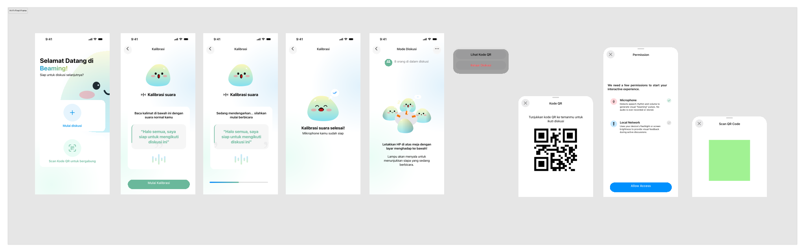

# Beaming

**Beaming** is an offline iOS application utilizing local P2P networking and hardware flashlights to help deaf users visually identify the active speaker during small group discussions (up to 8 people).

## Features

- **Local P2P Networking**: Utilizes Apple's `Network.framework` and Bonjour (mDNS) zero-configuration networking. No cloud, no database, no internet requirement—only Wi-Fi needs to be toggled ON.
- **Role-Based Permissions Flow**: Respects user privacy by only requesting hardware permissions necessary for their role (Deaf or Hearing).
- **The "One-Speaker Lock" Mechanic**: Synchronizes audio detection and flashlight activation to ensure the deaf user can easily identify the active speaker via a visual cue (the phone's flashlight).
- **Face-Down State**: A battery-saving, full-screen dark overlay for hearing users when their phone is placed face-down on the table during an active meeting.
- **Host Handover**: Seamless transition of host responsibilities to the oldest guest if the original host leaves the room.

## Technical Stack

- **Target Platform**: iOS (iPhones only)
- **Architecture**: MVVM with strict separation of UI and business logic
- **Frameworks**: SwiftUI, Network, AVFoundation, CoreMotion, CoreImage

## Usage

1. **Onboarding**: Enter your name to get started. (Microphone and local network permissions will be requested).
2. **Home**: Choose to either create a new discussion ("Mulai diskusi") or join an existing one by scanning a QR code ("Scan Kode QR untuk bergabung").
3. **Meeting**: Place the phone face-down on the table. The phone will detect speech and automatically illuminate the flashlight to indicate the active speaker.
4. **QR Code Sharing**: As a host or participant in a room, access the "..." menu to display a shareable QR code for others to scan and join instantly.

## Development

Currently in active development with a structured git workflow:
- `main`: Stable releases
- `staging/*`: Pre-release testing environments
- `dev/*`: Active feature development

## Acknowledgments
Designed and built for inclusivity.
